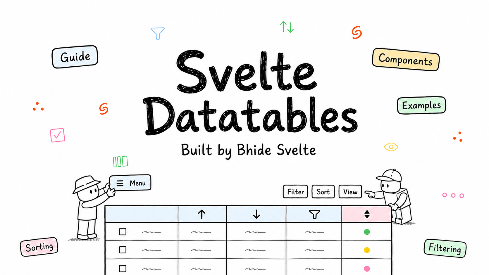

# Svelte Datatable Components & Blocks



Reusable data table components and complete table blocks for Svelte 5, SvelteKit,
and TanStack Table v9.

[Documentation](https://sv-table.vercel.app/docs/introduction) ·
[Components](https://sv-table.vercel.app/components) ·
[Blocks](https://sv-table.vercel.app/blocks)

## Components

- Selection: row checkbox, header checkbox, and bulk actions bar
- Navigation: number pagination, arrow pagination, and page-size selector
- Filtering: data table filters, faceted filter, date-range filter, number-range
  filter, and debounced input
- Table controls: column header, column visibility, row actions, and CSV export
- States: loading skeletons and empty-result states

Install a component directly from the registry:

```bash
pnpm dlx shadcn-svelte@latest add https://sv-table.vercel.app/r/filters.json
```

Replace `filters` with the component name you need. See the
[installation guide](https://sv-table.vercel.app/docs/installation) for full
setup instructions.

## Blocks

The project includes complete examples for:

- Basic data tables and row selection
- Built-in and custom filtering
- Sortable and resizable columns
- Draggable and pinnable columns
- Expandable sub-rows
- Paginated and numeric-pagination tables
- A complex table combining multiple features

Browse and copy them from the [blocks gallery](https://sv-table.vercel.app/blocks).

## Credits

Inspired by [Bazza UI](https://bazza-ui.com/) and [COSS UI](https://cossui.com/).
Table examples are powered by
[TanStack Table Svelte v9](https://tanstack.com/table).

Built by
[Bhide Svelte](https://bhide.dev?utm_source=sv-table&utm_medium=readme&utm_campaign=sv-table).

## Support my work

If Svelte Datatable has been helpful, consider
[sponsoring my work](https://github.com/sponsors/SikandarJODD) to support its continued development and more open-source Svelte projects.

## Other Projects

All projects are free & open-source.

| Project                       | GitHub                                                          | Preview                                          |
| ----------------------------- | --------------------------------------------------------------- | ------------------------------------------------ |
| Svelte 5 Animations (60+ New) | [Repository](https://github.com/SikandarJODD/animations)        | [Preview](https://sv-animations.vercel.app)      |
| Svelte Animations (old)       | [Repository](https://github.com/SikandarJODD/svelte-animations) | [Preview](https://animation-svelte.vercel.app)   |
| Svelte AI Elements            | [Repository](https://github.com/SikandarJODD/ai-elements)       | [Preview](https://svelte-ai-elements.vercel.app) |
| 150+ Marketing Blocks         | [Repository](https://github.com/SikandarJODD/cnblocks)          | [Preview](https://sv-blocks.vercel.app)          |
| 60+ Premium Marketing Blocks  | [Repository](https://github.com/SikandarJODD/sv-efferd)         | [Preview](https://sv-efferd.pages.dev)           |
| Svelte Agentation (Library)   | [Repository](https://github.com/SikandarJODD/sv-agentation)     | [Preview](https://sv-agentation.com)             |
| Svelte Dot Matrix Loaders     | [Repository](https://github.com/SikandarJODD/sv-matrix)         | [Preview](https://sv-matrix.vercel.app)          |
| Svelte Qblocks                | [Repository](https://github.com/SikandarJODD/sv-particles)      | [Preview](https://sv-particles.vercel.app)       |
